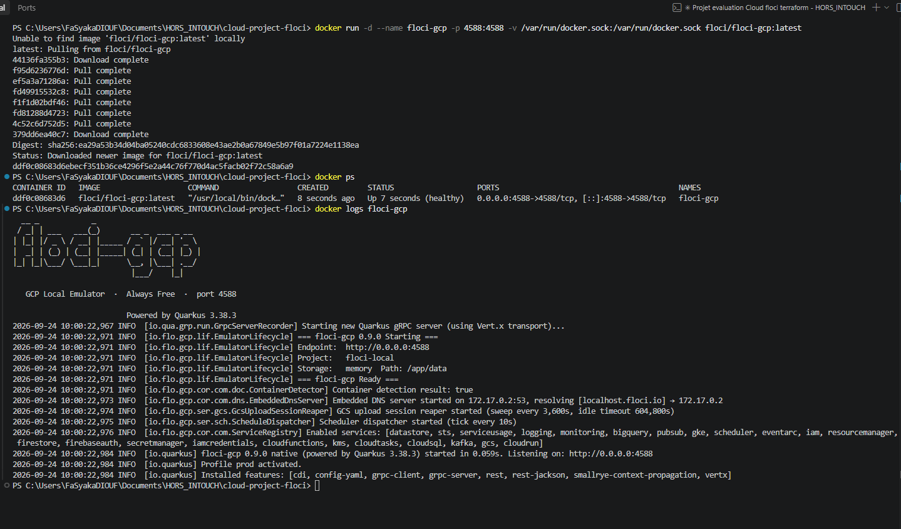
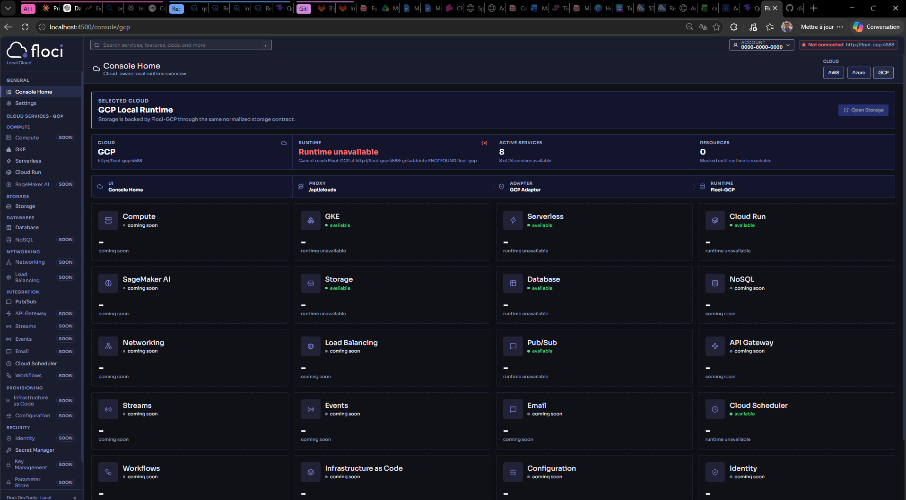
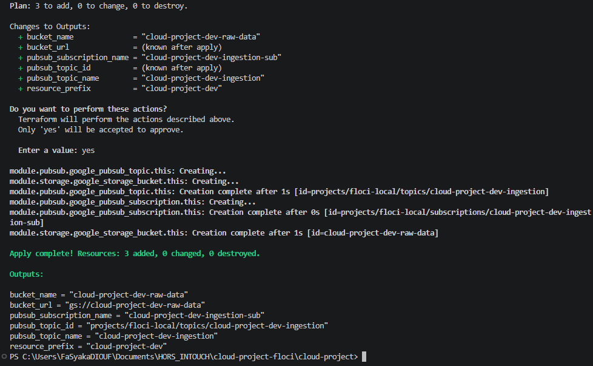
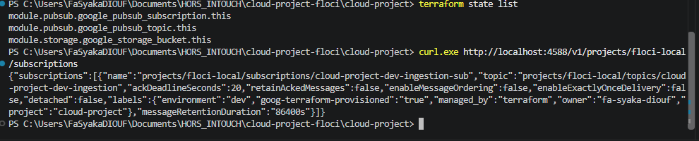
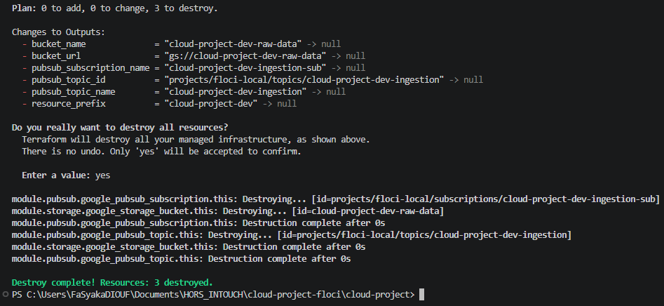

# Cloud Project - Terraform + Floci (GCP)

Déploiement de deux services **Google Cloud** avec **Terraform** sur un environnement Cloud **local** émulé par **Floci**, puis vérification dans **Floci UI**.

| | |
|---|---|
| **Cloud Provider** | Google Cloud Platform (GCP) - émulé par `floci/floci-gcp` (port **4588**) |
| **Service 1** | **Cloud Storage** (GCS) - module [`modules/storage`](modules/storage) |
| **Service 2** | **Pub/Sub** - module [`modules/pubsub`](modules/pubsub) |
| **Outil IaC** | Terraform ≥ 1.6, provider `hashicorp/google` ~> 7.0 |

---

## 1. Choix du provider et des services

### Pourquoi GCP ?

J'utilise GCP au quotidien (en stage a InTouch : BigQuery, Datastream, Dataform, Terraform). Le provider Terraform `google` m'est familier, ce qui me permet de me concentrer sur ce que le projet apporte de nouveau : **rediriger ce provider vers un émulateur local**.

### Pourquoi Cloud Storage + Pub/Sub ?

Les deux services forment la base d'un **pipeline d'ingestion de données** :

- **Cloud Storage** : zone d'atterrissage des fichiers bruts (*raw zone* d'un data lake) → bucket `cloud-project-<env>-raw-data` ;
- **Pub/Sub** : bus d'événements de l'ingestion ; un topic reçoit les événements (ex. « nouveau fichier arrivé ») et un abonnement permet à un traitement en aval (ex. un chargement BigQuery) de les consommer → topic `cloud-project-<env>-ingestion` + abonnement `cloud-project-<env>-ingestion-sub`.

Ils sont **complémentaires** (stockage + messagerie), **légers** (pas de conteneur supplémentaire, contrairement à Cloud SQL ou GKE) et **supportés à la fois par Floci GCP et par Floci UI**.

> **Pourquoi pas BigQuery ?** BigQuery est bien supporté par l'émulateur `floci-gcp` (l'API répond), mais **Floci UI n'a pas d'écran BigQuery** (aucun adaptateur dans `floci-ui/packages/api/src/adapter-gcp/`). L'énoncé exigeant une vérification dans Floci UI, j'ai retenu des services visibles dans l'interface.

---

## 2. Prérequis

| Outil | Version testée |
|---|---|
| Docker Desktop | 4.x (daemon démarré) |
| Terraform | 1.15.8 |
| Git | pour cloner Floci UI |

Aucun compte Google Cloud ni identifiant n'est nécessaire.

---

## 3. Lancer Floci (GCP)

```powershell
docker run -d --name floci-gcp `
  -p 4588:4588 `
  -v /var/run/docker.sock:/var/run/docker.sock `
  floci/floci-gcp:latest
```

Vérification :

```powershell
docker ps                     # floci-gcp doit être "Up ... (healthy)"
docker logs floci-gcp         # bannière + "Enabled services: [... gcs, pubsub, ...]"
curl.exe "http://localhost:4588/storage/v1/b?project=floci-local"
# -> {"kind":"storage#buckets"}
```

| Provider Floci | Port |
|---|---|
| AWS | 4566 |
| Azure | 4577 |
| **GCP (utilisé ici)** | **4588** |
| OCI | 4599 |

Le projet GCP par défaut de l'émulateur est **`floci-local`**.



---

## 4. Lancer Floci UI

Le `docker-compose.yml` de Floci UI démarre par défaut son propre runtime AWS, et le profil `multicloud` démarre **son propre** `floci-gcp` (conflit sur le port 4588) ainsi qu'un script qui injecte des ressources de démonstration. On ne lance donc **que l'UI et son API**, puis on y rattache notre conteneur `floci-gcp` :

```powershell
cd ..                                         # à côté du projet, pas dedans
git clone https://github.com/floci-io/floci-ui.git
cd floci-ui

# UI (port 4500) + API (port 4501), sans les dépendances (AWS/Azure/seed)
docker compose up -d --build --no-deps floci-api floci-ui

# Rattache floci-gcp au réseau de l'UI : l'API le joint via http://floci-gcp:4588
docker network connect floci_default floci-gcp
```

Ouvrir **http://localhost:4500/console/gcp**.

Remarques :

- le message *« Cannot reach Floci core at http://floci:4566 »* concerne le runtime **AWS**, volontairement non lancé : il peut être ignoré ;
- Cloud Storage est affiché sous le libellé **« Storage »** dans Floci UI ;
- après un redémarrage de Docker : `docker start floci-gcp` puis `docker network connect floci_default floci-gcp`.



---

## 5. Structure du projet

```text
cloud-project/
├── README.md
├── main.tf               # appels des modules storage et pubsub
├── providers.tf          # provider google redirigé vers Floci
├── variables.tf          # variables racine (+ validations)
├── locals.tf             # resource_prefix, common_labels, is_prod
├── outputs.tf            # outputs racine (exposent ceux des modules)
├── versions.tf           # contraintes Terraform / provider
├── terraform.tfvars      # valeurs par défaut (dev)
├── environments/
│   ├── dev.tfvars
│   └── prod.tfvars
├── tests/
│   └── main.tftest.hcl   # tests `terraform test` (provider simulé)
├── modules/
│   ├── storage/          # google_storage_bucket
│   └── pubsub/           # google_pubsub_topic + google_pubsub_subscription
└── screenshots/
```

---

## 6. Configuration de Terraform pour Floci

`providers.tf` :

```hcl
provider "google" {
  project = var.project_id        # "floci-local"
  region  = var.region

  access_token = var.fake_access_token   # jeton factice, aucune auth réelle

  storage_custom_endpoint = "${var.floci_endpoint}/storage/v1/"   # http://localhost:4588/storage/v1/
  pubsub_custom_endpoint  = "${var.floci_endpoint}/v1/"           # http://localhost:4588/v1/
}
```

### Terraform avec le vrai GCP vs Terraform avec Floci

| | Vrai GCP | Floci |
|---|---|---|
| Endpoints appelés | `https://storage.googleapis.com`, `https://pubsub.googleapis.com` | `http://localhost:4588/...` (**endpoint local**) |
| Authentification | vrais identifiants (ADC `gcloud auth application-default login`, compte de service) | jeton factice (`access_token`) |
| Projet | projet GCP réel, facturation activée | projet émulé `floci-local` |
| Coût / risque | ressources réelles, facturées | aucun coût, tout est local et jetable |
| Code des ressources | **identique** | **identique** |

Seule la configuration du **provider** change : les `*_custom_endpoint` redirigent chaque API vers l'émulateur. Les modules et ressources sont exactement ceux qu'on déploierait sur GCP ; pour passer au vrai cloud, il suffirait de retirer les endpoints personnalisés et le jeton factice.

### Variables, `tfvars`, `locals`, modules, outputs

- **Variables** (`variables.tf`) : nom du projet, environnement, endpoint Floci, paramètres du bucket et de Pub/Sub. Aucune valeur n'est écrite en dur dans les ressources. Plusieurs variables ont un bloc `validation` (environnement `dev`/`prod`, format de l'URL, classe de stockage, délai d'acquittement 10–600 s, format de la rétention…).
- **`terraform.tfvars`** : valeurs de l'environnement `dev`, chargées au déploiement.
- **`locals`** (`locals.tf`) :
  - `resource_prefix = "${var.project_name}-${var.environment}"` → utilisé dans le nom de **toutes** les ressources ;
  - `common_labels` → labels appliqués au bucket, au topic et à l'abonnement ;
  - `is_prod` → en `prod`, le versioning du bucket est forcé et `force_destroy` désactivé.
- **Modules** : `storage` et `pubsub` sont génériques (ils ne connaissent ni le projet ni l'environnement) et réutilisables : la racine leur passe un `name`, des paramètres et des `labels`.
- **Outputs** : chaque module expose ses informations (`bucket_name`, `bucket_url`, `topic_id`, `subscription_name`…), reprises par `outputs.tf` à la racine.

---

## 7. Déploiement

Depuis le dossier `cloud-project/`, avec Floci démarré :

```powershell
terraform init                                  # télécharge le provider google, installe les modules
terraform fmt -recursive                        # formate le code
terraform validate                              # vérifie la syntaxe et la cohérence
terraform plan  -var-file="terraform.tfvars"    # 3 ressources à créer
terraform apply -var-file="terraform.tfvars"    # confirmer avec "yes"
```

Résultat attendu :

```text
Apply complete! Resources: 3 added, 0 changed, 0 destroyed.

Outputs:
bucket_name              = "cloud-project-dev-raw-data"
bucket_url               = "gs://cloud-project-dev-raw-data"
pubsub_subscription_name = "cloud-project-dev-ingestion-sub"
pubsub_topic_id          = "projects/floci-local/topics/cloud-project-dev-ingestion"
pubsub_topic_name        = "cloud-project-dev-ingestion"
resource_prefix          = "cloud-project-dev"
```

---

## 8. Vérification dans Floci UI

Sur http://localhost:4500/console/gcp :

1. **Storage** → le bucket `cloud-project-dev-raw-data` apparaît ;
2. **Pub/Sub** → le topic `cloud-project-dev-ingestion` apparaît.



Floci UI n'affiche que les **topics** Pub/Sub (son adaptateur ne gère pas les abonnements). L'abonnement est vérifié via l'état Terraform et l'API REST de Floci :

```powershell
terraform state list
curl.exe http://localhost:4588/v1/projects/floci-local/subscriptions
```



---

## 9. Destruction

```powershell
terraform destroy -var-file="terraform.tfvars"   # confirmer avec "yes"
# -> Destroy complete! Resources: 3 destroyed.
```

Dans Floci UI, **Storage** et **Pub/Sub** sont de nouveau vides.



---

## 10. Bonus

### Environnements `dev` et `prod`

Chaque environnement a son fichier de variables et son **workspace** Terraform (donc son propre state) :

```powershell
terraform workspace new dev
terraform apply -var-file="environments/dev.tfvars"

terraform workspace new prod
terraform apply -var-file="environments/prod.tfvars"
```

| | dev | prod |
|---|---|---|
| Préfixe | `cloud-project-dev` | `cloud-project-prod` |
| Versioning du bucket | selon la variable | **forcé** (`local.is_prod`) |
| `force_destroy` | `true` (jetable) | `false` (protège les données) |
| Rétention Pub/Sub | 1 jour | 7 jours |
| Délai d'acquittement | 20 s | 60 s |

Revenir ensuite au workspace par défaut : `terraform workspace select default`.

### Tests Terraform

`tests/main.tftest.hcl` utilise un **provider simulé** (`mock_provider "google"`) : les tests tournent sans Floci ni réseau.

```powershell
terraform test
```

Ils vérifient le nommage via `local.resource_prefix`, la transmission des outputs des modules, la protection des données en `prod`, le module `storage` testé isolément, et le rejet des valeurs invalides par les blocs `validation`.

```text
Success! 6 passed, 0 failed.
```

### Validation avancée des variables

Blocs `validation` sur `project_name`, `environment`, `floci_endpoint`, `bucket_storage_class`, `message_retention_duration`, `ack_deadline_seconds`, ainsi que sur les noms de ressources dans les modules.

### Documentation des modules avec terraform-docs

La configuration est dans `.terraform-docs.yml` ; la documentation est injectée entre les balises `BEGIN_TF_DOCS` / `END_TF_DOCS` de ce README et de ceux des modules ([storage](modules/storage/README.md), [pubsub](modules/pubsub/README.md)).

```powershell
# via Docker (aucune installation nécessaire)
docker run --rm -v "${PWD}:/terraform-docs" quay.io/terraform-docs/terraform-docs:latest /terraform-docs

# ou avec le binaire installé
terraform-docs .
```

---

## 11. Référence technique (générée par terraform-docs)

<!-- BEGIN_TF_DOCS -->
## Requirements

| Name | Version |
|------|---------|
| terraform | >= 1.6.0 |
| google | ~> 7.0 |

## Providers

No providers.

## Modules

| Name | Source | Version |
|------|--------|---------|
| pubsub | ./modules/pubsub | n/a |
| storage | ./modules/storage | n/a |

## Resources

No resources.

## Inputs

| Name | Description | Type | Default | Required |
|------|-------------|------|---------|:--------:|
| environment | Environnement de déploiement. | `string` | n/a | yes |
| project\_name | Nom du projet, utilisé comme préfixe des ressources. | `string` | n/a | yes |
| ack\_deadline\_seconds | Délai d'acquittement des messages, en secondes. | `number` | `20` | no |
| bucket\_location | Localisation du bucket (région ou multi-région). | `string` | `"EU"` | no |
| bucket\_storage\_class | Classe de stockage du bucket. | `string` | `"STANDARD"` | no |
| bucket\_versioning | Active le versioning des objets du bucket. | `bool` | `false` | no |
| fake\_access\_token | Jeton factice envoyé à Floci (aucune authentification réelle). | `string` | `"floci-fake-token"` | no |
| floci\_endpoint | URL de l'émulateur Floci GCP (sans slash final). | `string` | `"http://localhost:4588"` | no |
| message\_retention\_duration | Durée de rétention des messages de l'abonnement (ex : "86400s"). | `string` | `"86400s"` | no |
| owner | Responsable des ressources (ajouté en label). | `string` | `"student"` | no |
| project\_id | ID du projet GCP. Floci GCP utilise "floci-local" par défaut. | `string` | `"floci-local"` | no |
| region | Région GCP par défaut. | `string` | `"europe-west1"` | no |

## Outputs

| Name | Description |
|------|-------------|
| bucket\_name | Nom du bucket Cloud Storage. |
| bucket\_url | URL gs:// du bucket. |
| pubsub\_subscription\_name | Nom de l'abonnement Pub/Sub. |
| pubsub\_topic\_id | ID complet du topic Pub/Sub. |
| pubsub\_topic\_name | Nom du topic Pub/Sub. |
| resource\_prefix | Préfixe commun des ressources. |
<!-- END_TF_DOCS -->
